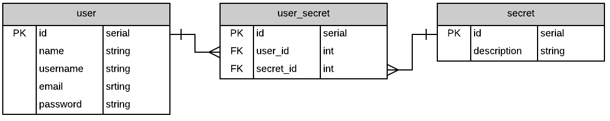

# Express with Auth[entication]

## A JavaScript web app for node that enables you to get authentication and authorization running _locally_ and on _heroku_ very fast.

# localhost Setup Instructions

### The sign up and log in forms above will work once you follow a few steps. Ready?

## Step 1 - Clone the repository

Make a local copy of the repository by cloning it to your computer. Run this command:

git clone git@github.com:ericwallen/express-with-auth.git

## Step 2 - Change directory

Navigate into the new package folder by running this command:

cd express-with-auth

## Step 3 - Install dependencies

This is a node package with many dependencies. Assuming you have node installed run the following command:

npm install

## Step 4 - Create a .env file and add token key/value pair

Lets create the "environment variable". With the touch command create the .env file and put a token key/value inside.

touch .env

## Step 5 - Start it up

Now boot it up and navigate to http://localhost:8080/. You will see the signup, login forms as well as the instructions to install.

npm start

http://localhost:8080

TOKEN_SECRET=new_hotness

## Step 6 - Create a Database

For this package to work out of the box you will want to name your database exampledb. If you want to change the database name look in the root of express-with-auth for a file called knexfile.js. Inside that you will see the path to postgresql://localhost/exampledb. Change that to whatever your heart desires. Use this command you will use to create the db:

createdb exampledb

## Step 7 - Migrate & Seed Database

This is an ERD diagram of how the posgresql table schema is laid out.

If you are ok with how we constructed the data you can run the commands below. The ERD is for visual purposes only.

knex migrate:latest

knex seed:run

## Step 8 - Verify Everything is Working Locally

Log in to the pre-created accounts you see below. The password for all the default users is "password". After login you will see the users dashboard as well as a secret specific to each user. The data specific to each user is the authorized to see.

### Batman

email: darkness@pitchblack.ceo  
password: password

### Superman

email: super@man.com  
password: password

### Wonder Woman

email: women@kickass.com  
password: password

### Captain America

email: yeah@merica.com  
password: password

# Heroku Deploy Instructions

### Heroku has become known to developers as a popular place to deploy full stack apps so we show you how to that however, you can deploy this whenever you feel comfortable.

## Step 1 - Create a Heroku account and login

If you don't alread have a heroku account you can create one at [heroku.com](https://heroku.com/). After you do that run the command you see below in your terminal. You will be prompted for your email address and password.

heroku login

## Step 2 - Run heroku create

You can initialize a new heroku app by running this command:

heroku create

## Step 3 - Copy the URL to 2 places inside your app

When you did "heroku create" there was a web address for your new app. It would look something like this "https://intense-journey-34289.herokuapp.com/". You need to copy that and replace the "http://localhost:8080/" inside two files.

1.  public > dashboard > app.js
2.  public > home > app.js

// Replace this  
var baseURL = "http://localhost:8080/"  

// With something like this  
var baseURL = "https://intense-journey-34289.herokuapp.com/"

## Step 5 - Save and commit

Now save your work and then commit

git add -A

git commit -m "commit"

## Step 6 - Push your app files to the server

Your files are ready to to be transfered to heroku. Do that with this command:

git push heroku master

## Step 7 - add the environment varialbe key/value pair to heroku

Just like your local host heroku needs the enviroment variable however, it is added through the command line. Run this command:

heroku config:set TOKEN_SECRET=new_hotness

## Step 8 - postgresql addon

Provision a postgresql database with this command:

heroku addons:create heroku-postgresql:hobby-dev

## Step 9 - Migrate & Seed heroku Database

To migrate and seed on the server run the following commands:

heroku run knex migrate:latest

heroku run knex seed:run

